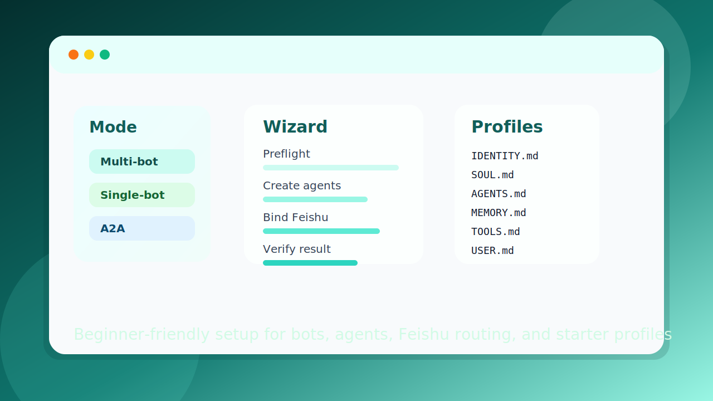

# OpenClaw Multi-Agent Wizard

[English](./README.md)


这是一个面向新手的 OpenClaw/Codex 技能，用安装向导式的方式一步一步帮助用户完成多 Agent 搭建，重点放在安全默认值、通俗解释和飞书接入。



## 这个仓库解决什么问题

很多多 Agent 教程默认用户已经理解这些概念：

- agent ID
- 绑定关系
- 路由规则
- 群聊映射
- 飞书机器人接入

这个技能反过来从新手视角出发：

- 先问一个容易回答的问题
- 优先推荐最安全的模式
- 自动生成 Agent 起步档案
- 用简单语言解释每一步
- 做完验证后再宣布完成

## 它能帮你做什么

- 选择适合新手的多 Agent 模式
- 创建一个或多个 OpenClaw Agent
- 自动生成 Agent 的 starter profile 文件
- 一步一步接入飞书机器人
- 配置更稳妥的路由默认值
- 用自然语言总结最终配置结果

## 支持的模式

### 1. 多 bot 多 agent

一个 bot 对应一个 agent。

例子：

- 工作 bot -> 工作助理
- 生活 bot -> 生活助理

这是最推荐的新手默认模式。

### 2. 单 bot 多 agent

一个飞书 bot 共用，不同飞书群路由到不同 agent。

例子：

- 产品群 -> 产品助理
- 工程群 -> 工程助理

V1 只支持基于群聊的路由。

### 3. A2A 协作

一个主 agent 对外回复，一个或多个 worker agent 在后台协作。

例子：

- 主助理在飞书里公开回复
- 数据助理负责找数字
- 写作助理负责润色最终答案

## 自动生成的文件

为每个新 agent 工作区自动生成：

- `IDENTITY.md`
- `SOUL.md`
- `AGENTS.md`
- `MEMORY.md`
- `TOOLS.md`
- `USER.md`

这些文件会给 agent 一个轻量但完整的起步配置，包括身份、边界、协作方式、记忆重点和用户定位。

## 飞书接入重点

当前版本重点支持飞书，因为它是非常适合新手上手 OpenClaw 的路径之一。

流程被拆成了很小的步骤：

1. 创建飞书应用
2. 开启机器人能力
3. 复制 `App ID` 和 `App Secret`
4. 完成事件订阅
5. 连接 OpenClaw
6. 绑定 bot 或群路由
7. 做最终验证

## 设计原则

- 先做预检
- 一次只推进一小步
- 优先安全默认值
- 尽量少改配置
- 验证通过后再算完成
- 优先提高新手成功率，而不是追求功能全覆盖

## 当前边界

- 单 bot 多 agent 目前只支持飞书群路由
- 私聊路由视为进阶能力
- 高级运行时编排只解释，不默认开启
- 同群公开多 Agent 交互视为实验特性

## 目录结构

```text
openclaw-multi-agent-wizard/
|-- SKILL.md
|-- README.md
|-- README.zh-CN.md
|-- LICENSE
|-- CONTRIBUTING.md
|-- CODE_OF_CONDUCT.md
|-- CONTRIBUTORS.md
|-- agents/
|   `-- openai.yaml
|-- assets/
|   |-- icon-small.svg
|   |-- icon-large.svg
|   `-- repo-preview.svg
|-- references/
|   |-- a2a-mode.md
|   |-- advanced-mode.md
|   |-- command-branches.md
|   |-- dialogue-scripts.md
|   |-- feishu-setup.md
|   |-- final-summary.md
|   |-- migration-existing-setup.md
|   |-- modes.md
|   |-- persona-templates.md
|   |-- preflight.md
|   |-- quick-start.md
|   |-- routing-basic.md
|   `-- troubleshooting.md
`-- scripts/
    |-- generate_agent_ids.py
    |-- render_setup_summary.py
    |-- suggest_persona_kind.py
    |-- write_identity_template.py
    `-- write_starter_profile.py
```

## 安装方式

把这个技能放到 Codex 能发现本地技能的位置。

常见路径：

```text
$CODEX_HOME/skills/openclaw-multi-agent-wizard
```

如果没有设置 `CODEX_HOME`，常见默认路径是：

```text
~/.codex/skills/openclaw-multi-agent-wizard
```

## 校验

基础脚本校验：

```bash
python -m compileall scripts
```

如果本地有 skill validator，也可以运行：

```bash
python /path/to/quick_validate.py /path/to/openclaw-multi-agent-wizard
```

## 后续可以继续增强

- 增加飞书之外的接入路径
- 增强对已有 OpenClaw 配置的迁移支持
- 增强生成 persona 的细化程度
- 扩展 A2A worker 的角色模板

## 社区

- [贡献指南](./CONTRIBUTING.md)
- [行为准则](./CODE_OF_CONDUCT.md)
- [贡献者](./CONTRIBUTORS.md)

## 许可证

本项目基于 [MIT License](./LICENSE) 开源。
